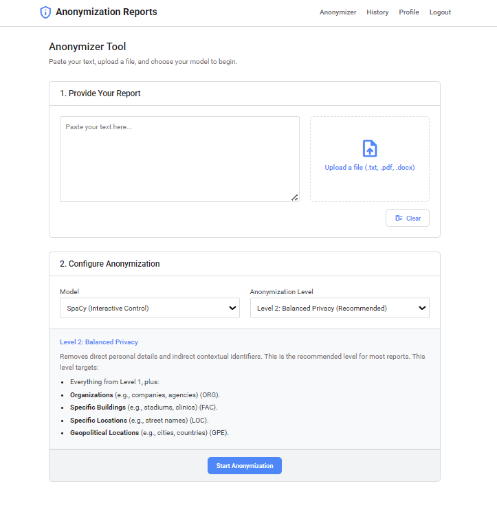

# Anonymization Reports

A sophisticated Flask web application for anonymizing sensitive text using AI and rule-based methods. This tool is designed to protect the privacy of individuals in "Lived Experience Reports" and other sensitive documents while preserving the authenticity and core meaning of the narrative.

---

## Table of Contents

- [About The Project](#about-the-project)
- [Key Features](#key-features)
- [Built With](#built-with)
- [Getting Started](#getting-started)
  - [Prerequisites](#prerequisites)
  - [Installation](#installation)
- [Usage](#usage)
- [Project Structure](#project-structure)
- [Roadmap](#roadmap)
- [License](#license)
- [Acknowledgements](#acknowledgements)

---

## About The Project

"Lived Experience Reports" are narratives that describe personal experiences in detail, often containing genuine and concerning content. The challenge is to anonymize these reports to prevent individuals from being identified (directly or indirectly) while maintaining the integrity of the story.

Indirect identification is a key challenge. For example, a phrase like *"My nearest doctor is in Hillsborough, near the football stadium..."* could, along with other details, make a specific GP surgery identifiable.

This project provides a powerful and intuitive web application to solve this problem. It allows users to upload or paste text and intelligently identifies and replaces sensitive information with realistic alternatives, giving the user full control over the process.

<p align="center">
  
  <br>
  <em>*Application main interface*</em>
</p>
---

## Key Features

-   **User Authentication**: Secure user registration and login system to manage personal anonymization history.
-   **Dual Anonymization Models**:
    -   **SpaCy (Interactive Control)**: A powerful rule-based model that provides an interactive, step-by-step wizard for reviewing and approving every single change.
    -   **Advanced AI (Automated)**: Utilizes the OpenAI GPT-4o model for a more contextual, automated anonymization and grammatical correction (requires user's own API key).
-   **Intelligent Entity Grouping**: If a name like "Sarah Malik" appears, the system understands that subsequent mentions of "Sarah" or "Malik" refer to the same person and applies the change to all variations at once.
-   **Configurable Anonymization Levels**:
    -   **Level 1 (Essential)**: Anonymizes only direct identifiers like names and ages.
    -   **Level 2 (Balanced)**: Adds contextual identifiers like organizations and locations.
    -   **Level 3 (Maximum)**: A comprehensive pass that also removes dates, times, and monetary values.
-   **Robust Data Recognition**: Employs custom rules to identify various formats of ages, dates, times, and money (including symbols like `£`, `€`, `$` and numbers written as words).
-   **Secure History**: All past anonymization jobs are saved to the user's account. History is paginated and can be viewed, re-opened, or deleted.
-   **Flexible Input**: Users can either paste raw text directly or upload files (`.txt`, `.pdf`, `.docx`).
-   **Downloadable Reports**: Anonymized reports can be downloaded in `.pdf` or `.docx` format, with the option to include or exclude highlights on the changed text.
-   **Modern & Responsive UI**: A clean, Google-inspired user interface that is easy to use on any device.

---

## Built With

This project leverages a modern stack of technologies:

-   **Backend**: [Flask](https://flask.palletsprojects.com/), [Flask-SQLAlchemy](https://flask-sqlalchemy.palletsprojects.com/), [Flask-Login](https://flask-login.readthedocs.io/)
-   **Frontend**: HTML5, CSS3 (Flexbox & Grid), Vanilla JavaScript (ES6+)
-   **NLP & AI**: [SpaCy](https://spacy.io/) (for rule-based NLP), [OpenAI API](https://openai.com/docs)
-   **Database**: SQLite
-   **Deployment**: Gunicorn

---

## Getting Started

Follow these instructions to get a local copy up and running for development and testing.

### Prerequisites

Make sure you have the following installed on your system:
-   Python 3.8+
-   `pip` (Python package installer)

### Installation

1.  **Clone the repository:**
    ```sh
    git clone [https://github.com/nkenta/anondev.git](https://github.com/nkenta/anondev.git)
    cd anonymization_reports
    ```

2.  **Create and activate a virtual environment:**
    -   On macOS/Linux:
        ```sh
        python3 -m venv venv
        source venv/bin/activate
        ```
    -   On Windows:
        ```sh
        python -m venv venv
        .\venv\Scripts\activate
        ```

3.  **Install the required packages:**
    ```sh
    pip install -r requirements.txt
    ```
    This will install Flask, SpaCy, OpenAI, and all other necessary libraries, including downloading the `en_core_web_lg` SpaCy model.

4.  **Set up environment variables:**
    The application requires a secret key for session management. Create a file named `.flaskenv` in the root of the project directory.
    
    **.flaskenv**
    ```
    FLASK_APP=run.py
    FLASK_DEBUG=1
    SECRET_KEY='a_very_secret_and_long_random_string_for_production'
    ```
    *Replace the `SECRET_KEY` value with your own long, random string.*

5.  **Run the application:**
    ```sh
    flask run
    ```

6.  **Open the application in your browser** by navigating to:
    [http://127.0.0.1:5000](http://127.0.0.1:5000)

---

## Usage

1.  **Register & Login**: Create a new account or log in with existing credentials.
2.  **Set API Key (Optional)**: If you wish to use the "Advanced AI" model, navigate to your **Profile** page and enter your OpenAI API key.
3.  **Anonymize Text**:
    -   Navigate to the **Anonymizer Tool**.
    -   Paste your text or upload a `.txt`, `.pdf`, or `.docx` file.
    -   Choose your preferred model (`SpaCy` or `Advanced AI`).
    -   Select the desired Anonymization Level. The description box will detail what each level does.
    -   Click "Start Anonymization".
4.  **Review Changes**:
    -   If using the **SpaCy** model, an interactive stepper will guide you through each identified entity, allowing you to approve or customize the replacement.
    -   If using the **Advanced AI**, the result will be displayed directly.
5.  **Save or Download**:
    -   The final output will show all changes highlighted.
    -   You can save the report to your history by clicking "Save to History".
    -   To download immediately, you must first save the report. Then, from the **History** page, you can download any report as a PDF or DOCX file.

---

## Project Structure

The project follows a standard Flask application factory pattern for scalability and organization.

```plaintext
anondev/
├── app/                  # Main Flask application package
│   ├── __init__.py       # Application factory
│   ├── auth.py           # Authentication routes (login, register, logout)
│   ├── helpers.py        # Core logic: SpaCy, OpenAI, file generation
│   ├── main.py           # Main application routes (anonymizer, history)
│   ├── models.py         # SQLAlchemy database models (User, ReportHistory)
│
├── static/               # Static files
│   ├── css/style.css
│   └── js/main.js
│
├── templates/            # HTML templates
│   ├── base.html
│   ├── anonymize.html
│   └── ... (other templates)
│
├── instance/             # Instance folder (database file created here)
│   └── database.db
│
├── venv/                 # Virtual environment folder
├── requirements.txt      # Project dependencies
├── run.py                # Application entry point
```


---

## Roadmap

Future enhancements could include:
-   [ ] Support for more languages beyond English.
-   [ ] A "bulk anonymization" feature to process multiple documents at once.
-   [ ] An administrator dashboard for managing users and viewing usage statistics.
-   [ ] Integration with other data sources or external APIs.
-   [ ] Advanced coreference resolution for pronouns (e.g., linking "he" or "she" to a named person).

---

## License

Project under production. You're welcome to contribute. 

---

## Acknowledgements
-   This project was inspired by the need to create a practical privacy tool at Sheffield Hallam University.
-   Thanks to the teams behind Flask, SpaCy, and other open-source libraries that made this possible.